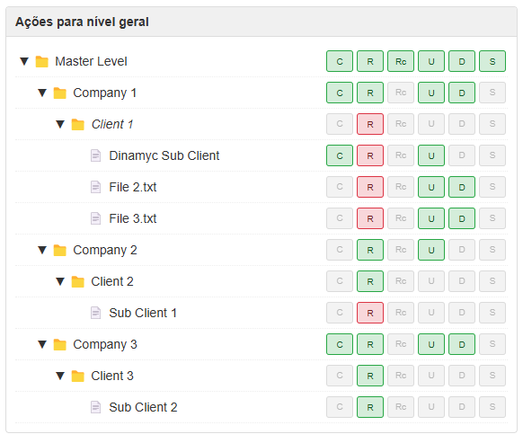

# Tree Action 🌳

[]

A zero-dependency vanilla JavaScript library for creating interactive treeviews and checklists with powerful features including CRUD operations, lazy loading, and customizable permissions.

[]

## ✨ Features

- 🚀 **Zero Dependencies** - Pure vanilla JavaScript implementation
- 🔄 **Full CRUD Operations** - Create, read, update, and delete nodes with granular permissions
- 📝 **Event-Driven Architecture** - Comprehensive event system for state management and UI updates
- 🎯 **Lazy Loading** - Load child nodes on-demand with built-in loading states
- 🔍 **Advanced Search** - Tree-wide search with path highlighting and async support
- ⚡ **High Performance** - Efficient handling of large datasets with optimized tree operations
- 🎨 **Customizable Styling** - Flexible CSS with BEM methodology
- 🔒 **Permission System** - Granular operation control with inheritance
- 🌐 **Modern Browser Support** - Works in all modern browsers

## 📥 Installation

```bash
npm install tree-action
# or
yarn add tree-action
```

Or include directly in your HTML:

```html
<link rel="stylesheet" href="https://unpkg.com/tree-action/dist/css/styles.min.css">
<script src="https://unpkg.com/tree-action/dist/js/all.min.js"></script>
```

## 🚀 Quick Start

[]

```javascript
// Initialize Tree Action
const tree = new TreeAction({
  operations: [
    { code: 'C', tooltip: 'Create' },
    { code: 'R', tooltip: 'Read' },
    { code: 'U', tooltip: 'Update' },
    { code: 'D', tooltip: 'Delete' }
  ],
  actionClickHandler: (node, action) => {
    console.log(`${action.code} clicked on node:`, node);
  }
});

// Add nodes
tree.addNode({
  id: 'root',
  text: 'Root Node',
  children: [
    {
      id: 'folder1',
      text: 'Folder 1',
      children: [
        { id: 'leaf1', text: 'Leaf 1' },
        { id: 'leaf2', text: 'Leaf 2' }
      ]
    }
  ]
});
```

## 🔧 Configuration

[]

```javascript
const options = {
  // Node Operations
  operations: [
    { code: 'C', tooltip: 'Create', icon: '➕' }
  ],
  
  // Event Handlers
  actionClickHandler: (node, action) => {},
  childrenLoader: async (node) => {},
  
  // Customization
  nodeFormatter: (node) => node.text,
  cssPrefix: 'tree-action',
  
  // Features
  enableSearch: true,
  lazyLoad: true,
  
  // Performance
  batchSize: 100,
  searchDebounce: 150
};
```

## 📊 Examples

### Basic Tree View
[]

### With Search
[]

### Lazy Loading
[]

Check out more examples in our [examples directory](examples/).

## 🛠️ API Reference

### TreeAction Class
```javascript
class TreeAction {
  constructor(options)
  addNode(nodeData)
  removeNode(nodeId)
  updateNode(nodeId, data)
  expandNode(nodeId)
  collapseNode(nodeId)
  search(query)
}
```

### Events
- `nodeCollapse` - Fired when a node is collapsed
- `nodeExpand` - Fired when a node is expanded
- `treeUpdate` - Fired on tree state changes
- `dataLoad` - Fired during data loading operations
- `searchStart/Complete` - Fired during search operations

Full API documentation available in our [API Reference](docs/API.md).

## ⚙️ Advanced Usage

### Custom Node Rendering
```javascript
const tree = new TreeAction({
  nodeFormatter: (node) => {
    return `<strong>${node.text}</strong> (${node.children?.length || 0})`;
  }
});
```

### Lazy Loading
```javascript
const tree = new TreeAction({
  lazyLoad: true,
  childrenLoader: async (node) => {
    const response = await fetch(`/api/children/${node.id}`);
    return response.json();
  }
});
```

### Permission Management
```javascript
const node = {
  id: 'folder1',
  text: 'Folder 1',
  permissions: {
    C: true,  // Can create
    R: true,  // Can read
    U: false, // Cannot update
    D: false  // Cannot delete
  }
};
```

## 🧪 Development

```bash
# Install dependencies
yarn install

# Build project
yarn build

# Run tests
yarn test
```

## 📈 Performance

- Efficient handling of 1000+ nodes
- Tree render < 100ms
- Operation response < 16ms
- Memory < 10MB for 1000 nodes

### Best Practices
- Use lazy loading for large datasets
- Implement virtual scrolling for 1000+ visible nodes
- Batch operations for multiple updates
- Enable search debouncing (default: 150ms)

## 🤝 Contributing

We welcome contributions! Please see our [Contributing Guide](CONTRIBUTING.md) for details.

1. Fork the repo
2. Create your feature branch
3. Commit your changes
4. Push to the branch
5. Open a Pull Request

## 📃 License

MIT © [Tree Action](LICENSE)
