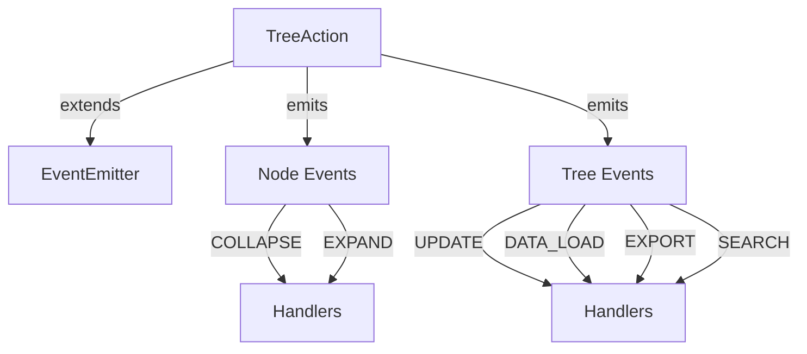
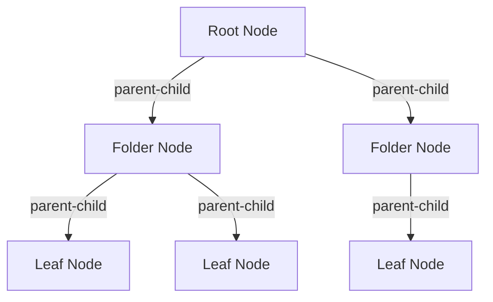
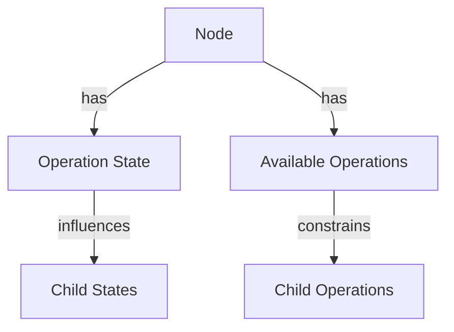
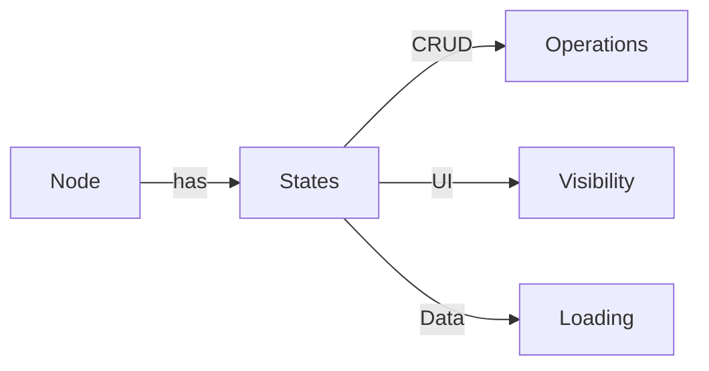
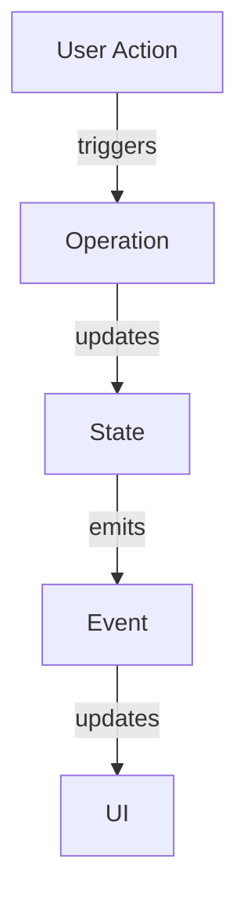
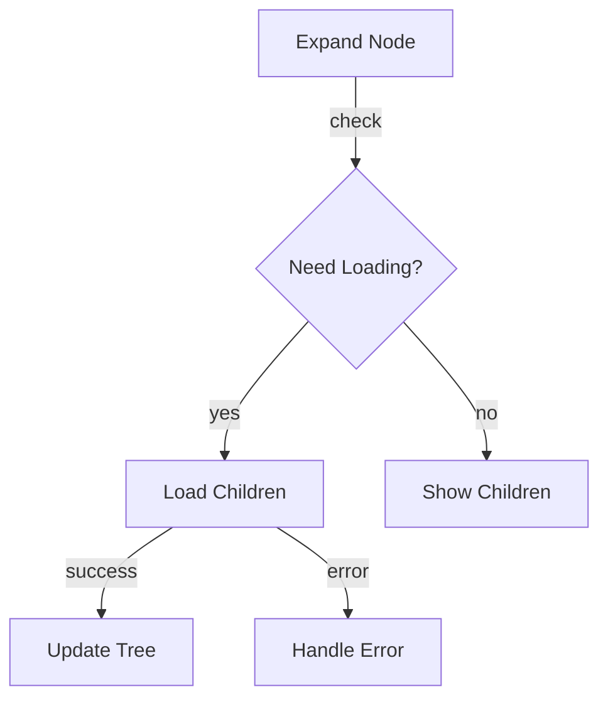
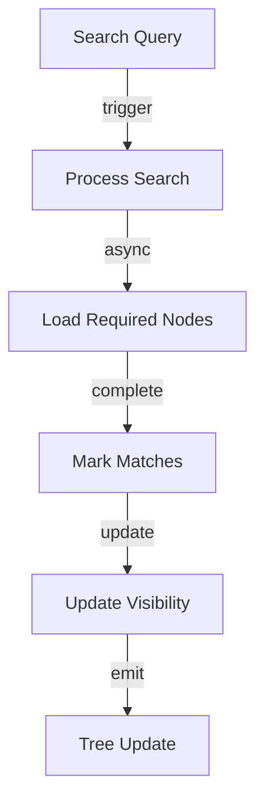

# System Patterns: Tree Action

## Core Architecture

### 1. Event-Driven System

#### Event Types
1. Node Events
   - nodeCollapse: Triggered when a node is collapsed
   - nodeExpand: Triggered when a node is expanded

2. Tree Events
   - treeUpdate: General tree state changes
   - dataLoad: Data loading operations
   - exportData: Tree serialization
   - searchStart/Complete: Search operations

### 2. Node Hierarchy

#### Node Relationships
- Parent reference: Each node maintains parent link
- Child collection: Folders contain child array
- Level tracking: Nodes track their depth
- Ancestry traversal: Both up and down tree

### 3. Operation Management

#### Operation Patterns
- State inheritance
- Mixed state handling
- Operation validation
- Permission propagation

## Key Design Patterns

### 1. Observer Pattern
- EventEmitter implementation
- State change notifications
- UI update triggers
- Async operation handling

### 2. Composite Pattern
- Tree node structure
- Recursive operations
- Unified node interface
- Hierarchical traversal

### 3. State Pattern

### 4. Factory Pattern
- Node creation
- Operation type management
- Event handling
- State initialization

## Data Flow Patterns

### 1. Tree Operations

### 2. Lazy Loading

### 3. Search Operations

## Implementation Guidelines

### 1. State Management
- Immutable state updates
- Event-driven changes
- Predictable flow
- Error boundary handling

### 2. Performance Optimization
- Lazy evaluation
- Efficient traversal
- Memory management
- Event debouncing

### 3. Error Handling
- Clear error states
- Recovery mechanisms
- User feedback
- State consistency

### 4. Testing Strategy
- Unit test patterns
- Integration testing
- Event testing
- State validation
