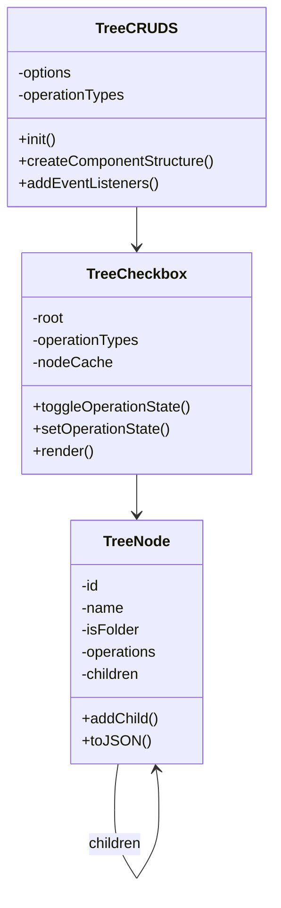

# System Patterns: Tree CRUDS Selection Component

## Architecture Overview



## Core Design Patterns

### 1. Component Pattern
- Main `TreeCRUDS` class acts as a self-contained component
- Handles initialization, DOM creation, and event management
- Maintains internal state and configuration

### 2. Composite Pattern (Tree Structure)
- `TreeNode` class represents both files and folders
- Recursive structure through parent-child relationships
- Consistent interface for all node types
- Supports hierarchical operations

### 3. Observer Pattern (State Management)
- Changes in node states trigger updates up and down the tree
- Parent nodes reflect children's states
- UI automatically updates based on state changes

### 4. Factory Pattern (Node Creation)
- Standardized node creation through constructor options
- Supports dynamic creation from JSON data
- Handles different node types (files vs folders)

### 5. Cache Pattern (DOM Management)
- NodeCache maps tree nodes to DOM elements
- Enables efficient updates without full re-renders
- Maintains performance with large trees

## State Management

### 1. Node States
```javascript
{
  operations: {
    C: "unselected" | "allowed" | "denied",
    R: "unselected" | "allowed" | "denied",
    // ... other operations
  },
  operationsMixed: {
    C: boolean,
    R: boolean,
    // ... other operations
  }
}
```

### 2. Operation Propagation
- Down propagation: Parent → Children
- Up propagation: Children → Parent (mixed states)
- Lazy evaluation for performance

## DOM Interaction Patterns

### 1. Event Delegation
- Single event listener at container level
- Delegates to appropriate handlers
- Efficient for dynamic content

### 2. Virtual DOM-like Updates
- Targeted updates through nodeCache
- Minimal DOM manipulation
- Optimized for performance

### 3. Lazy Loading
- On-demand child node loading
- Loading state management
- Async operation handling

## Technical Decisions

### 1. Zero Dependencies
- Pure vanilla JavaScript
- Native DOM manipulation
- Custom event handling

### 2. Performance Optimizations
- DOM caching
- Event delegation
- Targeted updates
- Lazy loading

### 3. State Management
- Hierarchical state propagation
- Efficient state calculations
- Mixed state handling

### 4. Code Organization
- Clear class responsibilities
- Modular design
- Separation of concerns

## Error Handling

### 1. User Input Validation
- Operation type validation
- JSON format validation
- State consistency checks

### 2. Async Operation Management
- Loading state indicators
- Error state handling
- Recovery mechanisms

## Integration Patterns

### 1. Data Import/Export
- JSON serialization
- State preservation
- Clean import/export interface

### 2. Component Configuration
- Options-based initialization
- Dynamic operation management
- Flexible styling support
